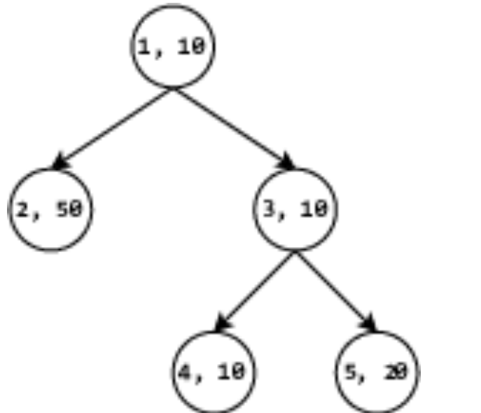
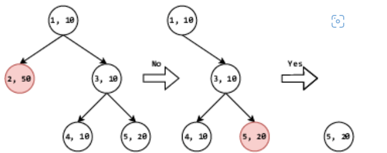
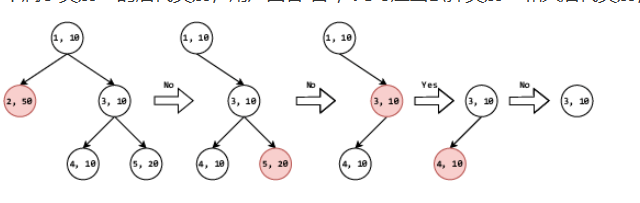

# Noun-Classifition-System
Using the c++ code to implement the noun classifition system
## Aim for the code
To implement the noun classsification system which would construct the classification tree and asking the customer questions `for example, if a belongs to b` accroding to the calculation.
## Using syntax
### 1) First you should construct the instance of the class `System` and give it two int values standing for the all nodes in the classification tree and  the amount of question which would be given respectively.
### 2) Then is a line where you would give each node a so-called `weight` value and accroding to the following algorithm the superiority of questioning would be calculated
#### The algorithm of weight
Every time the total classification tree would be narrowed to a smaller range, for all the nodes in the range, calculating two value `value1 and value2` respectively. Value1 adds up all the weight for a node and the subnodes belong to it, while value2 add up all the weight for the nodes which is not belong to it in the limited range. Then we could get the value which is the abstract value for `value1 - value2`. The smaller it is the higher superiority it would have.
### 3) This is a line demonstrating the structure for the classification tree. It starts with the parameter for the second node and ends with the last node's. Each parameter shows that which node would be its `father node`.
### 4) Then comes the lines whose amount equal to the asking times, each line has only one number which shows the node would be asked.
## The output form
1) Each line shows the node that the system would throw out to ask the tester, untill the final limited range for the requiered node is fixed
## Examples and Explanation
### 1) Instance input data is following:
5 2
10 50 10 10 20
1 1 3 3
5
2
### 2) It would construct a classification tree as following

### 3) Process analysis
#### Instance 1

1) Start with the root node, system would firstly calculate the the superiority for each node `It's 100 0 20 80 60`
2) Then it would test the 2ed node ,due to it not contains the aim, the customer would answer `false`, thus it would be discarded from the range
3) Calculating the superiority for `node1`,'node3`,`node4`,`node5`, would get the values 50 30 30 10, then consider the node 5
4) due to node 5 is the required node itself, the finding process is over and would be printed then
#### Instance 2

1) Start with the root node ,system calculate the superiority for each node. `(100,0,20,,80,60)`
2) Then test the second node and remove it
3) Caluclating the left nodes' superiority `(50,30,30,10)`
4) Test and discard the node five
5) Calculating the remaining nodes, results are `30 10 10`
6) Test Node 3 ,the remaining would be calculated as `20,0` for the node3 and node4, thus test the node4
7) Node 4 doesn't contain the requiered Node, thus discard it.
8) There is only the node3 left, the classification is clear and terminate the programm
### 4) The output that would get
2 5
2 5 3 4
## How to implement in your file
Include the Noun_Classificationm file and construct a `System` class to use it
